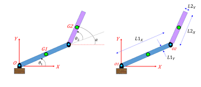

# CPPND: Capstone Hello World Repo



This is a repo for the Capstone project in the [Udacity C++ Nanodegree Program](https://www.udacity.com/course/c-plus-plus-nanodegree--nd213).

This project builds the representation of a 2 deegres of freedom (DOF) robotic arm with capabilities to compute forward and inverse kinematics.

Specifications:
* Angle 0: Rotational DOF that joins the first link with the base.
* Angle 1: Rotation DOF that joins the first and second link.
* Link 1: A 15 cm rigid body.
* Link 2: A 5 cm rigid body.

## Dependencies for Running Locally
* Run the install dependencies script: 
    ```sh
    chmod +x install_dependencies.sh
    ./install_dependencies.sh
    ```
or

* Install Armadillo 
    * Install Armadillo dependencies
    ```sh
    sudo apt install cmake libopenblas-dev liblapack-dev
    ```
    * Download the stable version of Armadillo [stable-version](http://arma.sourceforge.net/download.html)
    and install it: 
    ```sh
    cd Downloads/
    cd arma*
    cmake .
    make
    sudo make install
    ```


## Basic Build Instructions

1. Clone this repo.
2. Make a build directory in the top level directory: `mkdir build && cd build`
3. Compile: `cmake .. && make`
4. Run it: `./CapstoneProject`.